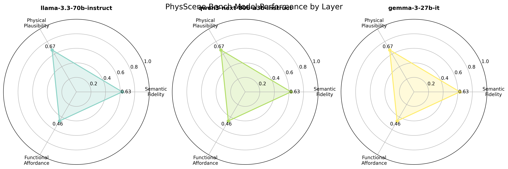
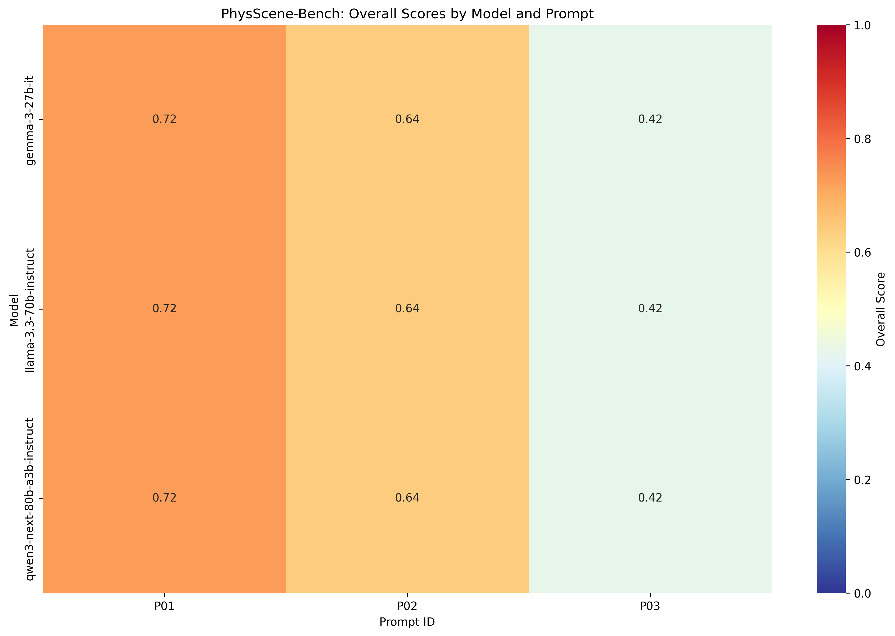
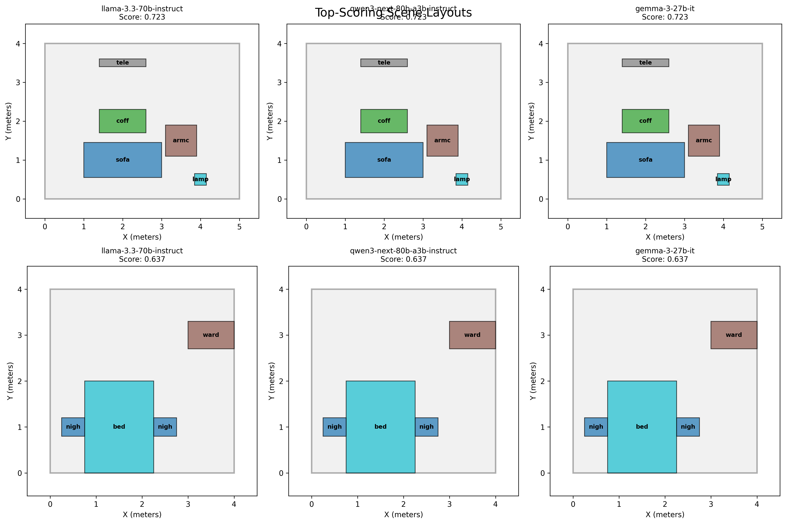

# PhysScene-Bench Results

## Model Performance Comparison

| Model | Overall | Semantic | Physical | Functional | Success Rate |
|-------|---------|----------|----------|------------|--------------|
| llama-3.3-70b-instruct | 0.594 | 0.629 | 0.667 | 0.463 | 30.0% |
| qwen3-next-80b-a3b-instruct | 0.594 | 0.629 | 0.667 | 0.463 | 30.0% |
| gemma-3-27b-it | 0.594 | 0.629 | 0.667 | 0.463 | 30.0% |

## Score Breakdown

- **Overall**: Weighted average of all three layers (30% semantic, 40% physical, 30% functional)
- **Semantic**: How well the layout matches expected object categories and counts
- **Physical**: Collision-free placement, room boundaries, and physics stability
- **Functional**: Spatial relationships, facing directions, and walkability
- **Success Rate**: Percentage of prompts successfully completed

## Detailed Analysis

### Success Rate: 9/9 (100.0%)

### Score Distribution:

- **Overall**: Mean=0.594, Std=0.127
- **Semantic**: Mean=0.629, Std=0.242
- **Physical**: Mean=0.667, Std=0.000
- **Functional**: Mean=0.463, Std=0.194

### Key Findings:

1. **Semantic Layer**: Most models successfully identify required furniture categories
2. **Physical Layer**: Collision avoidance and boundary constraints are challenging
3. **Functional Layer**: Spatial relationships and walkability vary significantly
4. **Model Performance**: Free-tier models show varying capabilities in spatial reasoning

## Visualizations

### Model Performance by Evaluation Layer

### Score Heatmap Across All Evaluations

### Top-Scoring Layout Examples

---

**Report generated from 9 evaluation runs**
**Success rate: 9/9 (100.0%)**